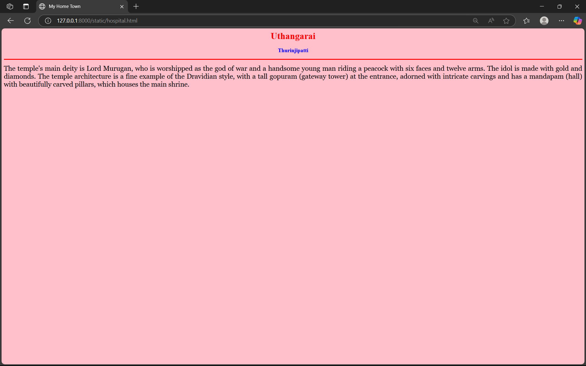

# Ex04 Places Around Me
## Date: 22/04/2025
## Reg no: 212224040243

## AIM
To develop a website to display details about the places around my house.

## DESIGN STEPS

### STEP 1
Create a Django admin interface.

### STEP 2
Download your city map from Google.

### STEP 3
Using ```<map>``` tag name the map.

### STEP 4
Create clickable regions in the image using ```<area>``` tag.

### STEP 5
Write HTML programs for all the regions identified.

### STEP 6
Execute the programs and publish them.

## CODE
```
map.html

<!DOCTYPE html>
<html lang="en">
<head>
  <meta charset="UTF-8">
  <title>MY CITY</title>
</head>
<body>
  <h1 align="center"><b>UTHANGARAI</b></h1>
  <h3 align="center"><b>PRASANTH T (212224040243)</b></h3>
  <center>
  
</center>
  <map name="mymap">
    <area shape="rect" coords="1725,213,1750,262" href="lake.html" alt="kanamoatti">
    <area shape="rect" coords="581,390,596,519" href="temple.html" alt="Pambardam">
    <area shape="rect" coords="118,144,970,154" href="petroleum.html" alt="vidhyavikas">
    <area shape="rect" coords="1452,888,1542,869" href="river.html" alt="Thenpenai">
    <area shape="rect" coords="1363,750,1558,813" href="hospital.html" alt="Thurinjipatti">
  </map>
</body>
</html>

hospital.html

<html>
  <head>
    <title>My Home Town</title>
  </head>
  <body bgcolor="pink">
    <h1 align="center">
      <font color="red"><b>Uthangarai</b></font>
    </h1>

    <h3 align="center">
      <font color="blue"><b>Thurinjipatti</b></font>
    </h3>

    <hr size="3" color="red">

    <p align="justify">
      <font face="Georgia" size="5">
        The temple's main deity is Lord Murugan, who is worshipped as the god of war and a 
        handsome young man riding a peacock with six faces and twelve arms. The idol is made 
        with gold and diamonds. The temple architecture is a fine example of the Dravidian style, 
        with a tall gopuram (gateway tower) at the entrance, adorned with intricate carvings and 
        has a mandapam (hall) with beautifully carved pillars, which houses the main shrine.
      </font>
    </p>
  </body>
</html>

river.html

<html>
  <head>
    <title>My Home Town</title>
  </head>
  <body bgcolor="pink">
    <h1 align="center">
      <font color="red"><b>Uthangarai</b></font>
    </h1>

    <h3 align="center">
      <font color="blue"><b>Thenpenai</b></font>
    </h3>

    <hr size="3" color="red">

    <p align="justify">
      <font face="Georgia" size="5">
        The Thenpennai River originates from the Nandi Hills in Karnataka.
        It flows through Tamil Nadu, supporting agriculture in many districts.
        The river is culturally significant and considered sacred in some areas.
        It helps irrigate crops like paddy, sugarcane, and bananas near Uthangarai.


      </font>
    </p>
  </body>
</html>

petroleum.html

<html>
  <head>
    <title>My Home Town</title>
  </head>
  <body bgcolor="pink">
    <h1 align="center">
      <font color="red"><b>Uthangarai</b></font>
    </h1>

    <h3 align="center">
      <font color="blue"><b>vidhyavikas</b></font>
    </h3>

    <hr size="3" color="red">

    <p align="justify">
      <font face="Georgia" size="5">
        Vidhya Vikas Hr. Sec. School is a well-known institution in Uthangarai.
        It offers quality education from primary to higher secondary levels.
        The school is known for academic excellence and discipline.
        Students actively participate in sports, cultural, and science events.


      </font>
    </p>
  </body>
</html>

lake.html

<html>
  <head>
    <title>My Home Town</title>
  </head>
  <body bgcolor="pink">
    <h1 align="center">
      <font color="red"><b>Uthangarai</b></font>
    </h1>

    <h3 align="center">
      <font color="blue"><b>kanamoatti</b></font>
    </h3>

    <hr size="3" color="red">

    <p align="justify">
      <font face="Georgia" size="5">
        Kanamoatti is a small village near Uthangarai with historical roots.
        It is known for its traditional farming culture and peaceful environment.
        The village has ancient temples that reflect local heritage and devotion.
        Over the years, it has preserved its rural charm and community spirit.
      </font>
    </p>
  </body>
</html>

temple.html

<html>
  <head>
    <title>My Home Town</title>
  </head>
  <body bgcolor="pink">
    <h1 align="center">
      <font color="red"><b>Uthangarai</b></font>
    </h1>

    <h3 align="center">
      <font color="blue"><b>Pambar Dam</b></font>
    </h3>

    <hr size="3" color="red">

    <p align="justify">
      <font face="Georgia" size="5">
        It was built in 1967 as part of the Sabarigiri 
        Hydroelectric Project. Sabarigiri Hydro Electric Project (IHEP)
        is the second largest hydro electric project in Kerala.
        Pamba dam's reservoir is connected to the nearby Kakki dam's reservoir
        by a 3.21 km (1.99 mi) long underground tunnel.
      </font>
    </p>
  </body>
</html>

```

## OUTPUT




## RESULT
The program for implementing image maps using HTML is executed successfully.
